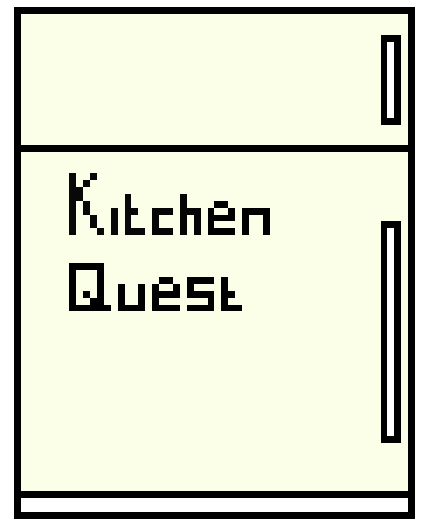

# _Kitchen Quest_

#### _An application for discovering recipes based on the ingredients a user has utilizing the spoontacular API., Feb 2020_

#### By _**Team Kitchen Quest**_

## Description

Users can enter the ingredients they have in their fridge and the application will provide a list of recipes that consist of the inputted ingredients, as well as a list of additional ingredients they will need to successfully create the suggested recipes. Users can search recipes to find cooking instructions. Lastly, users can click on fridge graphic for a cooking joke.

## Preview


## Project Specifications

| Behavior | Input | Output |
|---|:---:|:---:|
|user inputs the ingredients they have and clicks submit to recieve recipe inspiration|apple, sugar, flour|apple fritter|
|user inputs recipe name to recieve recipe instructions|apple fritter|Combine flour, sugar, salt, baking powder, cinnamon. Stir in milk and egg until just combined. Fold in apple...|
|user clicks on fridge graphic to recieve a cooking joke|graphic click|any salad is a ceasar salad if you stab it enough|

## Setup/Installation Requirements

_In Terminal:_

* Navigate to where you want this application to be saved, i.e.:
```cd desktop```
* Clone the file from GitHub with HTTPS
```git clone https://github.com/benjamin-thompdx/kitchen-quest.git```
* Open file in your preferred text editor
* On Mac: ```open -a {your text editor} kitchen-quest```
* On Windows: ```kitchen-quest```

_Download Manually:_

* Navigate to https://github.com/benjamin-thompdx/kitchen-quest.
* Click the green "Clone or Download" button.
* Click "Download ZIP".
* Click downloaded file to unzip.
* Open folder called "kitchen-quest".
* Right-click "index.html" and select your preferred browser or text editor.

_Note For Editors:_ 
* Once cloned/downloaded, to run and make changes, in the terminal simply run **$ npm install** to download necessary dependencies
* Run **$ npm run build** to create your dist folder with a bundle.js file
* Obtain API key from https://spoonacular.com/food-api
* Create .env file in the root directory of kitchen-quest
* Add the API keys to .env file (```API_KEY: input your API key here```)
* **IMPORTANT** Add .env file to .gitignore file 
* The API key will now be referenced within the kitchen-service.js file using the following syntax: ```${process.env.API_KEY}```
* Lastly, run **$ npm run start** to run the application

## Known Bugs

_No known bugs at this time._

## Support and contact details

_Have a bug or an issue with this application? [Open a new issue](https://github.com/benjamin-thompdx/kitchen-quest/issues) here on GitHub._

## Technologies Used

* HTML
* CSS
* Bootstrap
* Javascript
* jQuery
* Webpack
* Node.js
* spoonacular API

### License

[MIT](https://choosealicense.com/licenses/mit/)

Copyright (c) 2020 **_Team Kitchen Quest_**